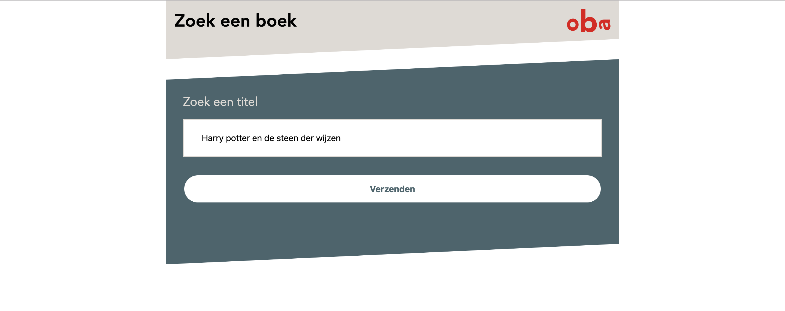

# Project 1 @cmda-minor-web · 2018-2019

<!-- ## Zoek in de de collectie van de OBA

Het project vindt plaats bij de Centrale OBA. Maandagochtend is om 10.00 uur de kickoff, vrijdag zijn de presentaties van de resultaten. In een week bouwt iedere student een eigen prototype dat bezoekers kan helpen om items uit de OBA collectie te vinden. Technieken geleerd bij [CSS to the Rescue](https://github.com/cmda-minor-web/css-to-the-rescue-1819) en [Web App from Scratch](https://github.com/cmda-minor-web/web-app-from-scratch-1819) worden toegepast bij het bouwen van de de prototypes.

We verzamelen maandagochtend om 09.45 op de 1e verdieping van de Centrale OBA, [Oosterdokskade 143](https://www.google.com/maps/place/OBA+library+of+Amsterdam/@52.3756983,4.9082087,15z/data=!4m2!3m1!1s0x0:0x6b97f693e6ecb494?ved=2ahUKEwioo6OrzubgAhWLNOwKHR6KDQgQ_BIwCnoECAYQCA). -->

## Demo
[Demo](https://jeroenvanberkum.nl/project-1-1819/)

## Concept
My first concept was to create an app in which you enter a recently listened CD and get suggestions bases on that CD. Including a preview of the CD and some more info. But the muziekweb API prove to be too difficult to work with with only one week of available time.  

My second concept is to create a search and find web app where a user enters the title of a book and sees on a map where it's available. For the locations where a book isn't available, it shows the return date(s). For this I wanted to use the OBA API's `/availability` endpoint. But the wrapper I'm using to work with the API client side didn't support that endpoint yet. I dug into why it wasn't working and found some things and created an [issue](https://github.com/maanlamp/OBA-wrapper/issues/2).

## Code
Don't look at it. It's a mess. kthx.
